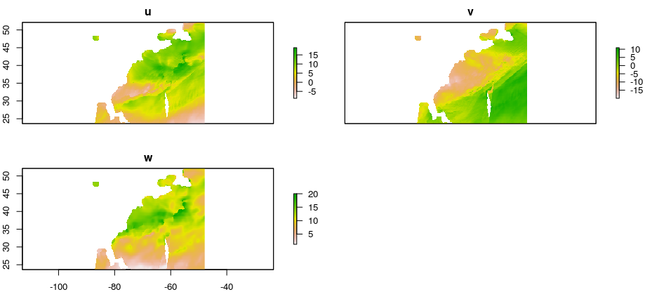
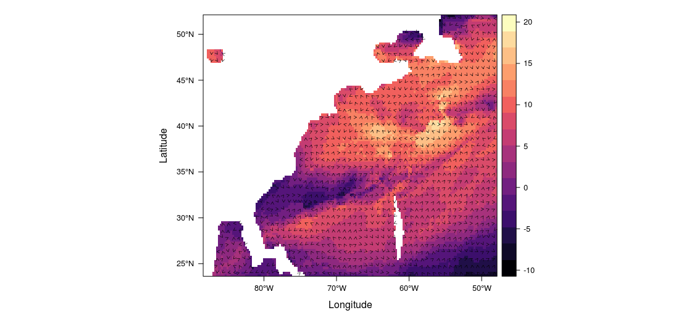

# BSW Blended Sea Winds gridded time series

This tool will harvest a gridded wind or surface stress time series from [BSW](https://www.ncdc.noaa.gov/data-access/marineocean-data/blended-global/blended-sea-winds) and (if you want) write the results to files. 

Keep in mind that you have options to select such as `type` ("wind" or "stress"), `daterange`, `period` ("6h", "daily", "monthly", or "climatology"), as well as others. Please consult the script file for details.

1) Have the file `BSW-grid.R` in your working directory
2) If you don't have the [ncdf4](https://CRAN.R-project.org/package=ncdf4) and [raster](https://CRAN.R-project.org/package=raster) packages already installed, install them:

```
install.packages(c('ncdf4', 'raster'))
```

3) Source the file:

```
source('BSW-grid.R')
```

4) Extract the data, optionally save the data to a location of your choice, and plot.

```
w_daily <- BSW_get_grid(period = "daily",
                        type = "wind",
                        bb = c(-88, -48, 24, 52),
                        daterange = c("2018-01-01", "2018-01-04"),
                        outpath = "./my_bsw")
plot(w_daily[[1]])
```


This will get you the daily wind data (u, v, and w) within the specified latitude and longitude bounding box, and between the specified start and end dates. The data will be written to the directory "./my_bsw" (or whatever you name it).

*Note: if you don't want to write files, but rather only load the data into R, then omit the `outfile` argument.  See the script for other available arguments.*

### Bonus

Try the plotting joys of the [rasterVis](https://oscarperpinan.github.io/rastervis/) package.

```
library(rasterVis)
rasterVis::streamplot(w_daily[[1]][[c("u","v")]], isField = TRUE)
```



---

Developer notes:

 - This is quick-and-dirty
 
 - There is limited error checking, so use at your own risk
 
 - To-Do  handle issues where bounding box, when converted to 0-360, wraps which requires stitching two downloads together.
