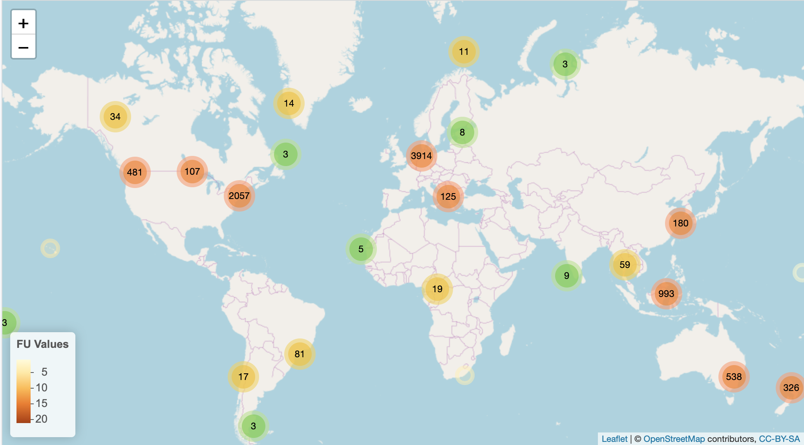

# Eye on Water observations


[Eye on Water](https://www.eyeonwater.org/) provides a platform for
serving water color and secchi disk observations. This script uses
[WFS](https://www.opengeospatial.org/standards/wfs) and specifically the
R package [rwfs](https://github.com/rOpenGov/rwfs) to downlaod
georefernced observations.

1.  Have the file `EOW-obs.R` in your working directory
2.  If you don't have the `rwfs` and `sf` packages already installed,
    please install them. Note that `rwsf` is only available from github,
    so you will need another R package, like
    [devtools](https://CRAN.R-project.org/package=devtools) or
    [remotes](https://CRAN.R-project.org/package=remotes), to help
    install it.

```
install.packages("sf")
devtools::install_github("ropengov/rwfs")
```

3. Source the file:

```
source('EOW-obs.R')

```

4. Extract the data:

```
x <- fetch_eow(path = getwd(), layer_name = "eow_all")
x
```

The data will be written to your working directory with the name
"eow_all.geojson", but you have other options to consider. See the
script file for details.

*Note: if you don't want to write a file, but rather load the data into
R, then omit the `path` argument*

We have also include a quick mapping tool which requires the
[leaflet](https://CRAN.R-project.org/package=leaflet) package.

```
plot_eow(x)
```


---

Developer notes: 

- This is quick-and-dirty 

- There is no error checking,
so use at your own risk
