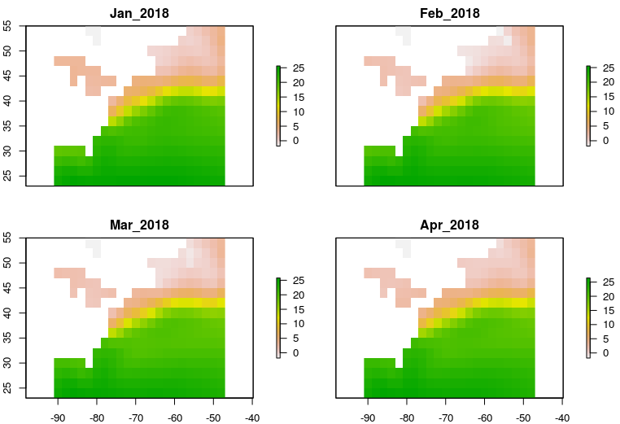
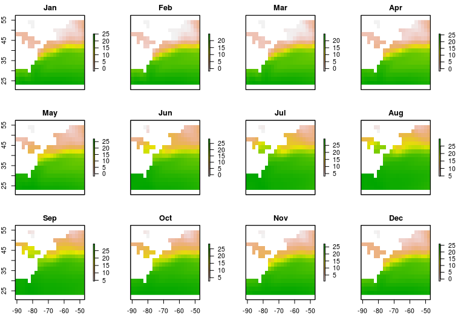

# ERSST Extended Reconstructed Sea Surface Temperature gridded time series

This tool will harvest a gridded sea surface temperature time series from [ERSST](https://www.esrl.noaa.gov/psd/data/gridded/data.noaa.ersst.v5.html) and (if you want) write the results to files. 

Keep in mind that you have options to select such as `type` ("month" or "ltm"), `daterange`, `bb` (bounding box [west, east, south, north]), as well as others. Please consult the script file for details.

1) Have the file `ERSST-grid.R` in your working directory
2) If you don't have the [ncdf4](https://CRAN.R-project.org/package=ncdf4) and [raster](https://CRAN.R-project.org/package=raster) packages already installed, install them:

```
install.packages(c('ncdf4', 'raster'))
```

3) Source the file:

```
source('ERSST-grid.R')
```

4) Extract the data, optionally save the data to a location of your choice, and plot.

```
sst <- ERSST_get_grid(type = 'month',
                      bb =  c(-88, -48, 24, 52),
                      daterange = c('2018-01-01', '2018-04-01'),
                      outpath = "./my_ersst")
plot(sst)
```


This will get you the monthly sea surface temperature 'sst' data within the specified latitude and longitude bounding box, and between the specified start and end dates (by month). In this example, the data will be written to the directory "./my_ersst" (or whatever you name it).

Also available are long term monthly means. In that case you always retrieve 12
layers for your bounding box - so you needn't specify a date range.

```
sst_ltm <- ERSST_get_grid(type = 'ltm',
                      bb =  c(-88, -48, 24, 52),
                      outpath = "./my_ersst")
plot(sst_ltm)
```



*Note: if you don't want to write files, but rather only load the data into R, then omit the `outfile` argument.  See the script for other available arguments.*

---

Developer notes:

 - This is quick-and-dirty
 
 - There is limited error checking, so use at your own risk
