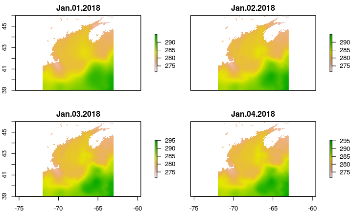

# MUR Sea Surface Temperature time series

This tool will harvest a gridded sea surface temperature time series from MURsst 
and (if you want) write the results to files.

1) Have the file `MURSST-grid.R` in your working directory
2) If you don't have the [ncdf4](https://CRAN.R-project.org/package=ncdf4) and [raster](https://CRAN.R-project.org/package=raster) packages already installed, install them:

```
install.packages(c('ncdf4', 'raster'))
```

3) Source the file:

```
source('MURsst-grid.R')
```

4) Extract the data, save the data to a location of your choice, and plot.

```
sst <- MUR_get_grid(bb =  c(-72, -63, 39, 46),
                    longitude = c(-72, -63),
                    daterange = c('2018-01-01', '2018-01-04'),
                    outpath = "./my_mur_sst")
plot(sst)
```


This will get you the daily sea surface temperature data within the specified latitude and longitude, and between the specified start and end dates. 
The data will be written to the directory "./my_mur_sst" (or whatever you name it).

*Note: if you don't want to write files, but rather only load the data into R, then omit the `outfile` argument.  See the script for other available arguments.*

---

Developer notes:

 - This is quick-and-dirty
 
 - There is limited error checking, so use at your own risk
