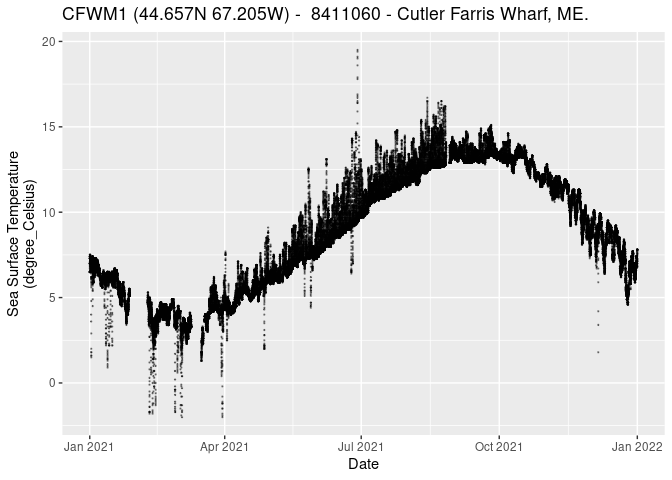

NDBC
================

# [National Data Buoy Center](https://www.ndbc.noaa.gov/)

To read [NDBC](https://www.ndbc.noaa.gov/) data we suggest that you use
the [rnoaa](https://docs.ropensci.org/rnoaa/) package from
[rOpenSci](https://ropensci.org/).

### Requirements

You only need the [rnoaa](https://docs.ropensci.org/rnoaa/) package to
get data, but we include helper packages, `dplyr` and `ggplot2`, for the
purpose of this tutorial.

``` r
suppressPackageStartupMessages({
  required <- c("dplyr", "ggplot2", "rnoaa")
  installed <- installed.packages() |>
    dplyr::as_tibble() 
  needed <- !(required %in% installed$Package)
  if (any(needed)){
    install.packages(required[needed])
  }
  ok <- sapply(required, library, character.only = TRUE)
})
```

Generate a list of buoys, and, as an example, narrow the list to Gulf of
Maine.

``` r
bb <- c(xmin = -72, xmax = -63, ymin = 39, ymax = 46)
buoys <- buoy_stations() |>
  dplyr::filter(dplyr::between(lat, bb['ymin'], bb['ymax']),
                dplyr::between(lon, bb['xmin'], bb['xmax']))
dplyr::glimpse(buoys)
```

    ## Rows: 65
    ## Columns: 12
    ## $ station         <chr> "44003", "44005", "44007", "44008", "44011", "44013", …
    ## $ lat             <dbl> 40.800, 43.201, 43.525, 40.504, 41.098, 42.346, 42.119…
    ## $ lon             <dbl> -68.500, -69.128, -70.141, -69.248, -66.619, -70.651, …
    ## $ viewport        <chr> "width=device-width, initial-scale=1.0", "width=device…
    ## $ DC.title        <chr> "NDBC Station Page", "NDBC Station Page", "NDBC Statio…
    ## $ DC.description  <chr> "National Data Buoy Center - Recent observations from …
    ## $ description     <chr> "National Data Buoy Center - Recent observations from …
    ## $ DC.subject      <chr> "weather, buoy, weather buoy, marine, forecast, hurric…
    ## $ DC.creator      <chr> "US Department of Commerce, National Oceanic and Atmos…
    ## $ DC.language     <chr> "EN-US", "EN-US", "EN-US", "EN-US", "EN-US", "EN-US", …
    ## $ DC.format       <chr> "text/html;charset=iso-8859-1", "text/html;charset=iso…
    ## $ DC.date.created <chr> "1996-11-08", "1996-11-08", "1996-11-08", "1996-11-08"…

We select one buoy, Cutler Farris Wharf, in Maine and filter the listing
down to just that one record (row).

``` r
CFW_id <- buoys |>
  dplyr::filter(grepl("Cutler Farris Wharf", description, fixed = TRUE))
dplyr::glimpse(CFW_id)
```

    ## Rows: 1
    ## Columns: 12
    ## $ station         <chr> "CFWM1"
    ## $ lat             <dbl> 44.657
    ## $ lon             <dbl> -67.205
    ## $ viewport        <chr> "width=device-width, initial-scale=1.0"
    ## $ DC.title        <chr> "NDBC Station Page"
    ## $ DC.description  <chr> "National Data Buoy Center - Recent observations from …
    ## $ description     <chr> "National Data Buoy Center - Recent observations from …
    ## $ DC.subject      <chr> "weather, buoy, weather buoy, marine, forecast, hurric…
    ## $ DC.creator      <chr> "US Department of Commerce, National Oceanic and Atmos…
    ## $ DC.language     <chr> "EN-US"
    ## $ DC.format       <chr> "text/html;charset=iso-8859-1"
    ## $ DC.date.created <chr> "1996-11-08"

Now we can pull buoy data, but only one dataset, such as standard
meteorology, for a single year at a time may be requested. The function
yields a list of two elements…

-   `meta` a list variable descriptions

-   `data` a data frame (tibble) with reported data

``` r
stdmet <- buoy("stdmet", CFW_id$station[1], year = 2021)
names(stdmet)
```

    ## [1] "meta" "data"

``` r
dplyr::glimpse(stdmet$data)
```

    ## Rows: 81,907
    ## Columns: 16
    ## $ time                    <chr> "2021-01-01T00:00:00Z", "2021-01-01T00:06:00Z"…
    ## $ lat                     <dbl> 44.657, 44.657, 44.657, 44.657, 44.657, 44.657…
    ## $ lon                     <dbl> -67.205, -67.205, -67.205, -67.205, -67.205, -…
    ## $ wind_dir                <int> 316, 299, 314, 316, 310, 312, 303, 322, 324, 3…
    ## $ wind_spd                <dbl> 2.0, 2.2, 1.7, 2.0, 2.2, 2.7, 2.6, 2.1, 1.7, 2…
    ## $ gust                    <dbl> 4.2, 5.1, 4.3, 4.0, 3.8, 4.2, 3.9, 4.4, 4.8, 5…
    ## $ wave_height             <dbl> NA, NA, NA, NA, NA, NA, NA, NA, NA, NA, NA, NA…
    ## $ dominant_wpd            <dbl> NA, NA, NA, NA, NA, NA, NA, NA, NA, NA, NA, NA…
    ## $ average_wpd             <dbl> NA, NA, NA, NA, NA, NA, NA, NA, NA, NA, NA, NA…
    ## $ mean_wave_dir           <int> NA, NA, NA, NA, NA, NA, NA, NA, NA, NA, NA, NA…
    ## $ air_pressure            <dbl> 1019.0, 1018.9, 1019.2, 1019.2, 1019.4, 1019.6…
    ## $ air_temperature         <dbl> 1.8, 2.0, 1.8, 1.8, 1.7, 1.6, 1.6, 1.4, 1.2, 1…
    ## $ sea_surface_temperature <dbl> 6.5, 6.5, 6.5, 6.5, 6.5, 6.5, 6.5, 6.5, 6.5, 6…
    ## $ dewpt_temperature       <dbl> NA, NA, NA, NA, NA, NA, NA, NA, NA, NA, NA, NA…
    ## $ visibility              <dbl> NA, NA, NA, NA, NA, NA, NA, NA, NA, NA, NA, NA…
    ## $ water_level             <dbl> NA, NA, NA, NA, NA, NA, NA, NA, NA, NA, NA, NA…

With just a little manipulation, we can start viewing the data
graphically. First we must convert the timestamp data from character to
numeric, specifically a POSIX timestamp (seconds of time since that
start of an arbitrary origin, in this case 1970-01-01 00:00:00).

``` r
stdmet$data <- dplyr::mutate(stdmet$data, time = as.POSIXct(time, format = "%Y-%m-%dT%H:%M:%SZ"))
```

``` r
sst_meta <- stdmet$meta$sea_surface_temperature
ggplot2::ggplot(data = stdmet$data, ggplot2::aes(x = time, y = sea_surface_temperature)) +
  ggplot2::geom_point(size = 0.2, alpha = 0.4) + 
  ggplot2::labs(title = sub("National Data Buoy Center - Recent observations from station ", "",
                             CFW_id$description),
                y = sprintf("%s\n(%s)", sst_meta$longname, sst_meta$units),
                x = "Date") 
```

<!-- -->
