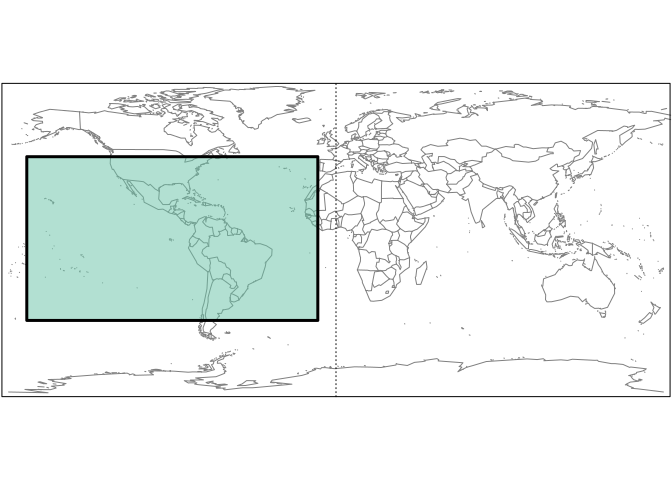
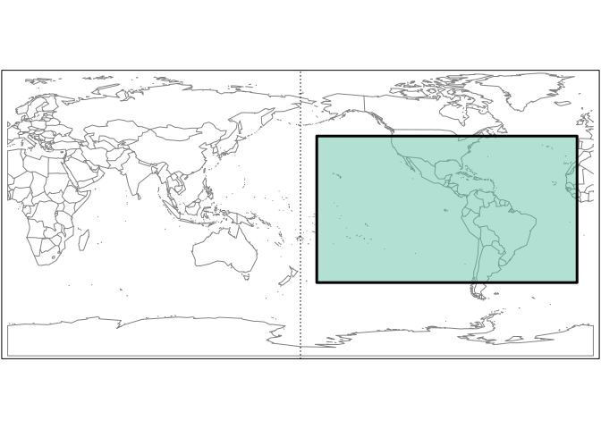
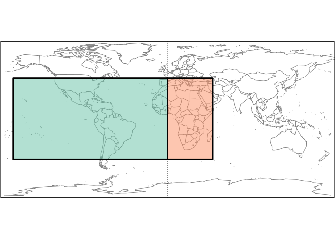
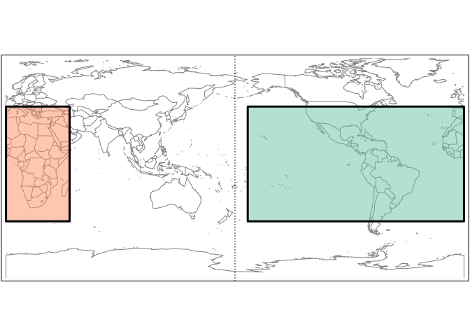
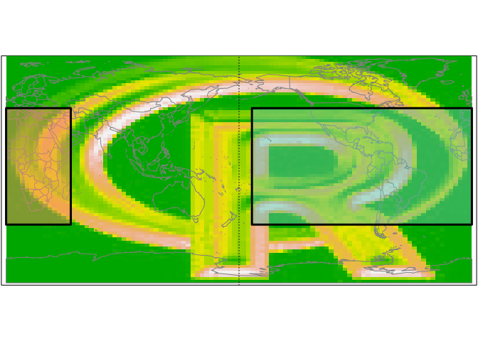
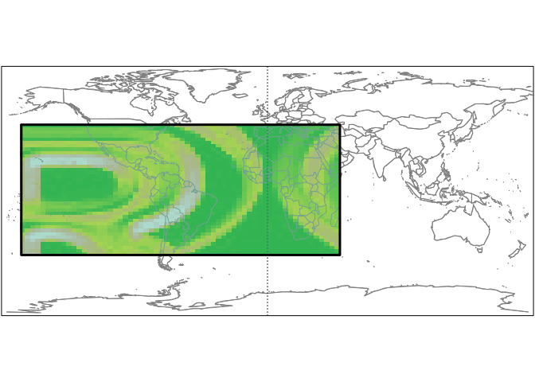

### Functions

Functions used in this document can be found on [github](https://github.com/BigelowLab/oharvester/blob/master/tutorials/bbox-vis/bbox-vis.R).

### Navigating gridded data with map wrap 

We usual work with world maps presented with the Greenwich meridian in the middle - that leaves the Pacifc Ocean to wrap around the edges of the map. The range of longitudes covers [-180,180]. Many gridded datasets are served like that, such as [Ocean Biology datasets](https://oceancolor.gsfc.nasa.gov/). Other gridded datasets are served with longitude ranging [0,360].  [Blended Sea Winds](https://www.ncdc.noaa.gov/data-access/marineocean-data/blended-global/blended-sea-winds) is an example. The [-180,180] and [0,360] maps are just wrapped version of each other.

Typically, we specify a bounding box with [east, west, south, north] order.  As long as the bounding box uses the same wrapping paradigm there is no trick to extracting subsets.  Here is a [-180,180] map with a typical bounding box. 


```r
bb1_180 <- c(-170, -10, -45, 45)
draw_map(database = "world", bb = bb1_180)
```



To extract the same bounding box from a [0,360] data product requires that we first transform the bounding box from [-180,180] to [0,360]. Then we can see that the bounding box translates to the correct region of the wrapped map.


```r
(bb1_360 <- to360BB(bb1_180))
```

```
## [1] 190 350 -45  45
```

```r
draw_map(database= "world2", bb = bb1_360)
```



### The pesky bounding box

A [-180,180] bounding box that crosses the origin presents a pesky challenge because it gets 'broken' by the wrap.  To manage that we split the bounding box into two, one one each side of the wrap point, and then translate each of those.


```r
bb2_180 <- c(-170, 50, -45,45)
(bb2s_180 <- bb_split(bb2_180, at = 0))
```

```
## $bb1
## [1] -170    0  -45   45
## 
## $bb2
## [1]   0  50 -45  45
```

```r
draw_map(database= "world", bb = bb2s_180)
```



```r
(bb2_360 <- sapply(bb2s_180, to360BB, simplify = FALSE))
```

```
## $bb1
## [1] 190 360 -45  45
## 
## $bb2
## [1]   0  50 -45  45
```

```r
draw_map(database= "world2", bb = bb2_360)
```



Summary... to retrieve a [-180-,180] bounding box that straddles a wrap longitude, just split the bounding box and then translate each of the two boxes to [0,360].  Then extract each.  

### Raster example

Below is an example that uses the [raster](https://cran.r-project.org/package=raster) to handle the grid.

First let's get some data.


```r
R <- raster::brick(system.file("external/rlogo.grd", package="raster"))[[1]]
raster::extent(R) <- c(0, 360, -90, 90)
draw_map(database = "world2", R = R, bb = bb2_360)
```



Now extract each piece.


```r
RR <- lapply(bb2_360,
      function(bb){
        raster::crop(R, bb)
      })
```

Retrieve the extent for each, and transform back to [-180, 180]. Then assign these as new extenbts for each raster.


```r
RR <- lapply(RR,
  function(R){
    e360 <- as.vector(raster::extent(R))
    e180 <- to180BB(e360)
    raster::extent(R) <- e180
    R
  })
```

And merge.  Note that we plot the map, add the raster, and then replot the map. Also note that our example map has pretty coarse resolution, so the actual cropped boundaries are pretty different than the requested ones.  


```r
newR <- raster::merge(RR[[1]], RR[[2]])
draw_map(database = "world", R = newR, bb = bb2_180)
```


