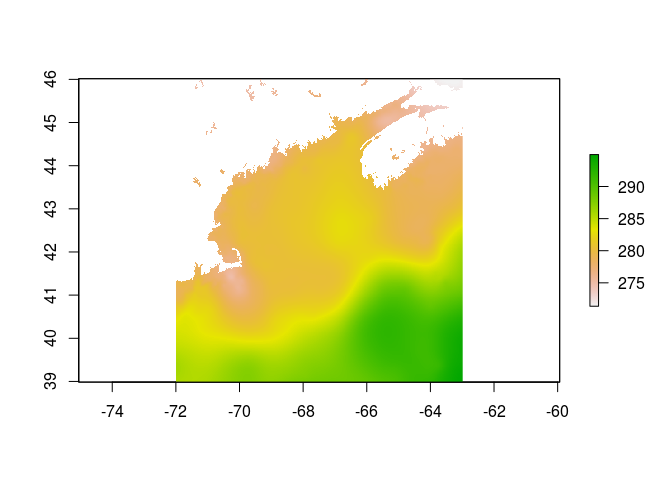

## NetCDF to raster

This tutorial is about extracting subsets of gridded data served by NetCDF files (including [OPeNDAP](https://www.opendap.org/)). We would be remiss if we didn't point out there are other ways to skins the cat - including reading data from local files directly with the [raster](https://CRAN.R-project.org/package=raster) package or using [stars](https://CRAN.R-project.org/package=stars).  We probably should all be migrating to the latter as it nestles smartly and beautifully with [sf](https://CRAN.R-project.org/package=sf) and the [tidyverse](https://CRAN.R-project.org/package=tidyverse).  


This tutorial shows to extract arrays of contiguous grid cells and transform into georeferenced [raster objects](http://rpubs.com/etiennebr/visualraster).


## An OPeNDAP resource

We'll use [MURSST](https://podaac.jpl.nasa.gov/dataset/MUR-JPL-L4-GLOB-v4.1?ids=&values=&search=MUR%20v4.1) as our example.  Note that there is already an [example script](https://github.com/BigelowLab/oharvester/tree/master/scripts/MURSST-grid) for downloading a batch of rasters from MURSST.

[NetCDF](https://www.unidata.ucar.edu/software/netcdf/) files are self-describing; objects (scalars, vectors, arrays) have attributes attached that help the end user unpack the contents without needing to be overly familiar with the contents. The self-describing bit doesn't mean that a NetCDF resource will always have complete information - sometimes the author of the resource doesn't add all of the relevant information, or does so in the (somewhat free form) global attributes rather than in the tightly self-describing variables or dimensions.  It's a matter of choise on the author's part.

Typically, it is best to simply define some parameters that may (or may not) be stored in the NetCDF resource.  Below we do just that, by defining the resolution and variable name which are stored in the resource.  But we also define the projection string needed to transform to raster, this is not defined in the file (nor would it need to be in this case as the data are unprojected.)  We also define the bounding box we wish to extract (more on bounding boxes [here](https://github.com/BigelowLab/oharvester/tree/master/tutorials/bbox-vis).)


```r
suppressPackageStartupMessages(library(ncdf4))
suppressPackageStartupMessages(library(raster))
mur_url <- file.path("https://podaac-opendap.jpl.nasa.gov/opendap/allData",
                     "ghrsst/data/GDS2/L4/GLOB/JPL/MUR/v4.1",
                     "2018/001/20180101090000-JPL-L4_GHRSST-SSTfnd-MUR-GLOB-v02.0-fv04.1.nc")
res <- c(0.01, 0.01)
varname <- "analysed_sst"
crs <- "+proj=longlat +datum=WGS84 +ellps=WGS84 +towgs84=0,0,0"
bb <-  c(-72, -63, 39, 46)
```

### Open and extract lon/lat

Let's open the file and extract the longitude and latitude locations which are stored in the `dim` section of the resource.  Note that opening procerss results in minimal transfer of data - just enough to completely define the contents of the file.  This is a great feature that removes the need to downlaod the entore file just to extract a small piece of it.

BTW, we have [printed](20180101090000-JPL-L4_GHRSST-SSTfnd-MUR-GLOB-v02.0-fv04.1.txt) the `ncdf4` object we create for your convenience - it's just like using [`ncdump -c`](https://www.unidata.ucar.edu/software/netcdf/workshops/2011/utilities/NcdumpExamples.html).


```r
x <- ncdf4::nc_open(mur_url)
lon <- x$dim$lon$vals
c(head(lon), tail(lon))
```

```
##  [1] -179.99 -179.98 -179.97 -179.96 -179.95 -179.94  179.95  179.96
##  [9]  179.97  179.98  179.99  180.00
```

```r
lat <- x$dim$lat$vals
c(head(lat), tail(lat))
```

```
##  [1] -89.99 -89.98 -89.97 -89.96 -89.95 -89.94  89.94  89.95  89.96  89.97
## [11]  89.98  89.99
```

**Note** that actual values of any `dim` are retrieved and stored in the `ncdf4`  object, `x`, when you call `nc_open`, so by extracting the values we are making a copy; we do so for clarity. This maybe something to avoid when making a 'real' processing script.

So the layout of of the grid cells are west-to-east `[-179.99 - 180.00]`, and south-to-north `[-89.99 - 89.99]`.  Keep in mind that these define the grid cell centers.  

### Match grid lon/lat to bounding box

The bounding box we defined is really a requested bounding box, the grid cells we return will be the closest matching that fully encapsulate the bounding box coordinates. Determining which grid cells match the requested bounding box involves padding the bounding box by one-half of grid resolution.  Padding prevents us from accidentally trimming the box.  Then we find the lon/lats that are the closest to the padded bounding box coordinates.


```r
half <- res/2                                            # half-res
pad_bb <- bb + c(-half[1], half[1], -half[2], half[2])   # pad bb
west_index  <- which.min(abs(lon - pad_bb[1]))           # closest lon to bb[1]   
east_index  <- which.min(abs(lon - pad_bb[2]))           # closest lon to bb[2]
south_index <- which.min(abs(lat - pad_bb[3]))           # closest lat to bb[3]
north_index <- which.min(abs(lat - pad_bb[4]))           # closest lat to bb[4]

closest_bb <- c(lon[west_index], lon[east_index],        # we don't use this,
                lat[south_index], lat[north_index])      # but if you are curious
```

### Construct NetCDF navigation and extract

Now we build the two components that describe the navigation for extraction: starting indicies (`start`) and run lengths (`count`).  Note that the variable we want to extract, "analyzed_sst", is [defined](20180101090000-JPL-L4_GHRSST-SSTfnd-MUR-GLOB-v02.0-fv04.1.txt) by `lon,lat,time` dimensions, so we must define `start` and `count` with three elements.  In this case there is only one time slice, so we will use default values for `start` and `count` as shown below. Be sure to read the help for `ncdf4::ncvar_get` as other arguments are at your disposal.


```r
start <- c(west_index, south_index, 1)      # time layer starts at index 1
count <- c(
  east_index - west_index + 1,              # number of cells west-to-east
  north_index - south_index + 1,            # number of cells south-to-north
  -1                                        # -1 means get entire slice of time
  )

start
```

```
## [1] 10800 12899     1
```

```r
count
```

```
## [1] 902 703  -1
```

```r
m <- ncdf4::ncvar_get(x, varid = varname, start = start, count = count)

dim(m)
```

```
## [1] 902 703
```

```r
m[1:5, 1:8]
```

```
##         [,1]    [,2]    [,3]    [,4]    [,5]    [,6]    [,7]    [,8]
## [1,] 285.651 285.663 285.674 285.687 285.699 285.711 285.724 285.737
## [2,] 285.646 285.658 285.669 285.682 285.694 285.706 285.719 285.732
## [3,] 285.641 285.653 285.664 285.676 285.689 285.701 285.714 285.727
## [4,] 285.636 285.647 285.659 285.671 285.684 285.696 285.709 285.722
## [5,] 285.631 285.642 285.654 285.666 285.678 285.691 285.704 285.717
```

### Convert matrix to raster

One of the raster creation methods includes making a raster from a matrix. Note that rasters are defined column-major (stored by column), but we requested from a row-major (stored by row) source.  So, we need to transpose the matrix when creating the raster. We provide the coordinates of the full extent of the matrix, which we visualize as a rubber-band encompassing the full extent of the cells.


```r
r <- raster::raster(t(m),                              # note the transpose
                    xmn = lon[west_index] - half[1],   # recall half = res/2
                    xmx = lon[east_index] + half[1],
                    ymn = lat[south_index] - half[2],
                    ymx = lat[north_index] + half[2],
                    crs = crs)                         # crs defined earlier
r
```

```
## class      : RasterLayer 
## dimensions : 703, 902, 634106  (nrow, ncol, ncell)
## resolution : 0.009999998, 0.009999995  (x, y)
## extent     : -72.005, -62.985, 38.985, 46.015  (xmin, xmax, ymin, ymax)
## crs        : +proj=longlat +datum=WGS84 +ellps=WGS84 +towgs84=0,0,0 
## source     : memory
## names      : layer 
## values     : 271.35, 294.997  (min, max)
```

### Flip it

Rasters are stored in a top-to-bottom paradigm.  But recall that we retrieved data that was stored -90 (ish) to 90 (ish).  So, we need to flip the raster top-to-bottom.


```r
r <- raster::flip(r, "y")
```

### Plot

There are lots of ways to plot rasters: some of our favorites are using packages [rasterVis](https://oscarperpinan.github.io/rastervis/), [leaflet](http://rstudio.github.io/leaflet/) and [tmap](https://CRAN.R-project.org/package=tmap).  But good old bvase graphics works well, too.


```r
plot(r)
```

<!-- -->


### Tidy up
Be sure to close the `ncdf4` connection.

```r
ncdf4::nc_close(x)
```
